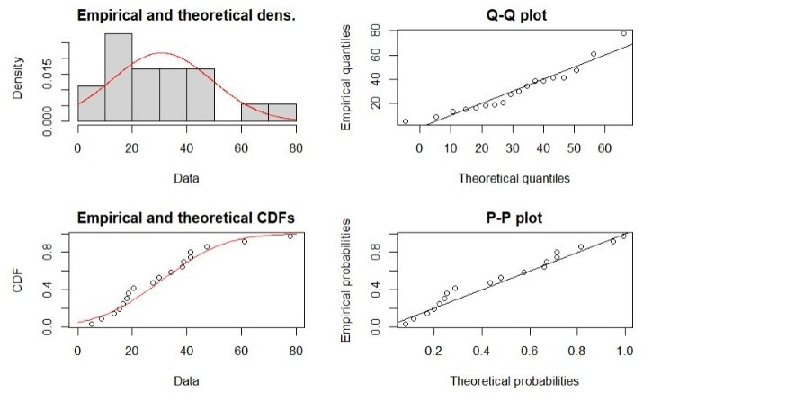
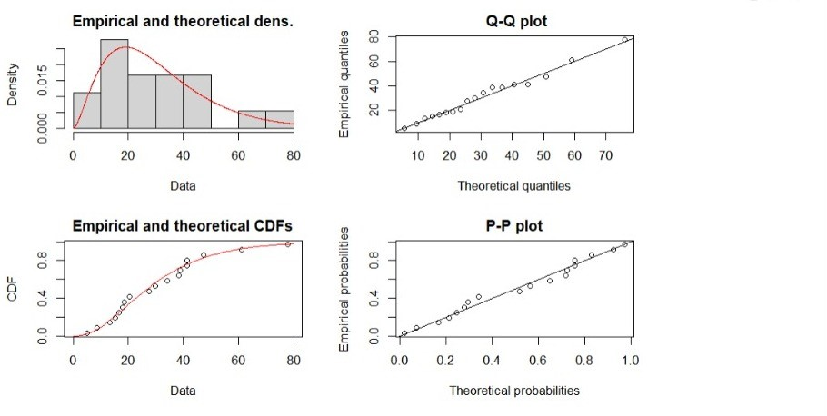
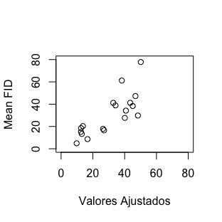

---      
title: "El compromiso entre disfrutar y molestar a las aves"
author: "Zaira García, Luis Requeni y Celia Sifre"
date: "27/11/2022"
geometry: margin = 2.5cm 
output: pdf_document
bibliography: sample.bib
---


```{r setup, include=FALSE}
knitr::opts_chunk$set(echo = TRUE)
library(fitdistrplus)
```

```{r echo=F, eval=T}
datos <- read.table(file = "FID.dat", header = T)
```


\section*{Resumen}


$~~$ Uno de los factores que potencialmente puede presentar mayor afección sobre el uso y
la selección de hábitat de las aves es la presencia humana. El objetivo de este estudio es demostrar si existe una relación entre el número de visitantes y la densidad de las gaviotas de las colonias sobre la FID (distancia de inicio de vuelo de las aves). 

$~~$ Los datos de este estudio fueron tomados en distintas colonias de parejas reproductoras de gaviotas patiamarillas (*Larus Michaellis*). Se obtuvo que para no causar una gran perturbación en el
hábitat de las gaviotas patiamarillas debe haber una relación de equilibrio entre el número de visitantes y la densidad de las distintas colonias. Es decir, el número de visitantes que visita estas zonas debería de estar controlado, ya que un número elevado de estos puede causar grandes perturbaciones en estas aves.


\section*{Introducción}

$~~$ Durante el siglo XX encontramos un auge en las actividades sociales fuera de las poblaciones urbanas (Anderson & Keith 1980; Boyle & Samson 1985; Hill et al. 1997; Ikuta & Blumstein 2003; Stankovich & Blumstein 2005). Por este motivo, surge una perturbación en el hábitat natural de algunas especies ya que se ven afectadas por la inesperada visita de humanos. Un ejemplo destacable de esta perturbación son las molestias que pueden recibir las gaviotas patiamarillas (*Larus Michahellis*) en la costa mediterránea española y francesa. 

$~~$ La distancia de alerta (FID) es la distancia a la cual un ave alza el vuelo al aproximarse un humano. Esta distancia es una medida normalmente empleada para establecer el nivel de perturbación que puede sufrir cada especie. Por tanto, nuestro objetivo en este trabajo consiste en analizar esta distancia para concluir el grado de perturbación que sufren las gaviotas patiamarillas y establecer unas distancias mínimas de seguridad entre los humanos y la especie. 


\section*{Material y métodos}

\subsection*{Zona de estudio}

$~~$ Nuestra zona de estudio constó de 15 colonias de gaviotas patiamarillas (*Larus Michaellis*). Consideramos las parejas reproductoras de aves y medimos la densidad de estas. Además, tuvimos en cuenta el número de visitantes de la zona. 

\newpage

$~~$ Once de nuestras colonias estaban localizadas en las costas mediterráneas entre España y Francia (Cap Caveaux, Fontagne, isla Plana y la isla Congloué [Marsella], la islas Medas y el Delta del Ebro [Cataluña], la isla Columbretes, la isla de Benidorm y el Peñón de Ifach [Valencia], isla Grosa [Murcia] y Sa Dragonera [Mallorca]). Dos estaban localizadas en la parte Atlántica de la Península Ibérica (las islas Cies y la isla de Ons) y otras dos las encontramos en la costa mediterránea del norte de Africa (isla del Congreso  y la isla del Rey, estas dos islas forman parte de las islas Chafarinas). Tres de las colonias nombradas anteriormente (Cies, Ons y Columbretes) fueron divididas en dos zonas: una visitada por humanos y otra que no fue visitada por estos. Esta separación se trató como colonias distintas.

\subsection*{Variable respuesta}

$~~$ Nuestra variable de estudio es la distancia FID. Los datos fueron recogidos caminando a lo largo de una línea recta hacia la gaviota o el grupo más cercano que estuviera dentro de la colonia a la que pertenecen. Aleatoriamente, se realizó la elección de una gaviota de referencia. Así, una vez la gaviota alzaba el vuelo, la distancia entre esta y el observador era medida con la ayuda de un telémetro de infrarrojos. 

$~~$ Este proceso se repetía las veces necesarias durante periodos de tiempo variables (entre 15 y 120 minutos)  para obtener un tamaño de muestra adecuado para el análisis estadístico. Se obtuvieron un total de 1081 medidas de distancia para el total de colonias. Debemos tener en cuenta que la velocidad y el número de observadores puede influir en la FID de las gaviotas (Herrera, 2007). Por este motivo, decidimos aproximar a las colonias 2 observadores a velocidad constante. 

$~~$ Como nuestro objetivo era medir la influencia del número de visitantes y la densidad de las gaviotas en la perturbación de las gaviotas por colonia, utilizamos la media de la variable respuesta. Ahora bien, tenemos que conocer qué tipo de distribución pueden seguir nuestros datos para poder construir con mejor detalle un modelo asociado a los mismos. 

\vspace{2cm}

\renewcommand{\figurename}{Figura}
{width=500 height=500}

\newpage

\renewcommand{\figurename}{Figura}
{width=500 height=500}


$~~$ Resulta bastante razonable asumir tanto una distribución normal como una distribución gamma para nuestro estudio. Se construyeron una serie de modelos con ambas distribuciones y se compararon distintos estadísticos ($R^2$ ajustado y AIC) a la hora de seleccionar el modelo que mejor se podría ajustar a nuestro banco de datos. Finalmente, elegimos la distribución gamma para nuestra variable respuesta.


\subsection*{Variables explicativas}

$~~$ Las dos variables explicativas que consideraremos son: la densidad de gaviotas en cada colonia y el número medio de visitantes. Los datos de la última variable explicativa mencionada fueron obtenidos de artículos no publicados de los gobiernos regionales de las zonas estudiadas. 

$~~$ La mayoría de las zonas de estudio fueron visitadas en temporada reproductora (cuando estas aves incuban sus huevos) para evitar la posible influencia del momento de reproducción en la distancia *FID*. 

$~~$ Consideramos el número medio de visitantes en la época reproductora de las gaviotas (abril y mayo) para las colonias situadas en la costa mediterránea. A diferencia de las colonias de la costa atlántica, que medimos los datos en los meses de mayo y junio. 

$~~$ Si una isla no era visitada regularmente por personas, más que ocasionalmente por investigadores, se asignó un dos como número de visitantes. La inclusión de un número bajo es adecuado para el experimento, evitando que el cero pueda afectar al análisis de los datos. La densidad se calculó como el número de parejas de gaviotas reproductoras en cada colonia, dividido por la superficie ocupada por la colonia. Para evitar datos faltantes, en las zonas en las que no se tenían datos obtenidos por medición propia se utilizaron informes de gobiernos regionales no publicados. 

```{r, echo=F, eval=T, warning=F}
library(knitr)
library(psych)
library(kableExtra)
descriptiva <- describe(datos)
kable(descriptiva[,-c(1,6,7)], digits = 2, format ="latex", 
      caption = "Descriptiva de nuestra base de datos") %>% kable_styling(
    latex_options = "HOLD_position",
    position = "center")
```

\newpage


\section*{Resultados}

$~~$ Los distintos estudios realizados apuntan a la modelización de nuestra variable respuesta mediante una regresión gamma.

$~~$ Nuestra variable respuesta $Y_{i}$ representa las distancia media a la que inician el vuelo las gaviotas de una determinada colonia, $i$, ante el acercamiento de un humano. Por tanto, tenemos una variable continua y positiva. Así, esta variable se distribuye como una Gamma de parámetros $\nu$ y $\lambda$:

\begin{center}
$Y_{i} \sim \text{Ga}(\nu_{i}, \lambda_{i})$.
\end{center}

$~~$ La componente sistemática de nuestro modelo estaría formada por 2 variables explicativas. *density*, que es una variable cuantitativa continua y *visitors*, que es una variable categórica ordinal con nivel bajo, medio y alto de visitantes.

$~~$ Sabemos que $\lambda = \nu/\mu$. Entonces, $\text{E}(Y_{i}) = \nu/\lambda = \mu_{i}$. Aunque sabemos que en la regresión gamma tenemos diferentes links para unir el predictor lineal con la respuesta media (logaritmo, inversa e identidad), hemos elegido el link $\text{log}$. Por tanto:

\begin{center}
$\text{log}(\mu_{i}) = \beta_{0} +  \beta_{1}x_{i} + \gamma_{1}d_{i2} + \gamma_{2}d_{i3}$ \quad ,
\end{center}

$~~$ donde $x_{i}$ representa la densidad de las gaviotas en la isla $i$ y $d_{ij}$ con $j=2,3$ es una variable indicadora que vale 1 o 0 en función del número de visitantes de la isla.

$~~$ En este trabajo hemos utilizado la inferencia bayesiana para realizar las estimaciones de los parámetros de nuestro modelo. En concreto, hemos utilizado INLA para obtenerlas. Se presentan a continuación:

```{r, eval=T, echo=F, warning=F, message=F}
library(INLA)
datos$visitors2 <- cut(datos$visitors, breaks = 3, labels = c(1, 2, 3), include.lowest = T)
datos$visitors2 <- as.factor(datos$visitors2)
ajuste.inla <- inla(meanFID ~ 1 + visitors2 + density, family = 'gamma',
                  data = datos,
                  control.inla = list(strategy = 'simplified.laplace'))
summary.inla <- summary(ajuste.inla)
kable(summary.inla$fixed) %>% kable_styling(
    latex_options = "HOLD_position",
    position = "center")
```


$~~$ Por tanto, podemos escribir nuestro modelo con la siguiente expresión:

\begin{center}
$\text{log}(\mu_{i}) = 3.96 - 0.003x_{i}  - 1.358d_{2} - 1.051d_{3}$ \quad ,
\end{center}

$~~$ donde $x_{i}$ representa el valor de la variable *density* y $d_{ij}$ trabaja como variable indicadora del número de visitantes. Entonces:

\begin{center}
$E(Y_{i}) = \mu_{i} = \text{exp}(3.96 - 0.003x_{i}  - 1.358d_{2} - 1.051d_{3})$ \quad .
\end{center}

$~~$ De esta manera, el modelo se interpreta como cambios porcentuales en $\text{E}(Y_{i})$ por cada incremento de una unidad en la variable densidad $x_{i}$ ($\% = 100 \dot (\exp(\beta_{1}))$).

\newpage

\renewcommand{\figurename}{Figura}
{width=200 height=200}
\section*{Conclusión}

$~~$ La categorización de la variable visitors se ha hecho teniendo en cuenta los distintos cuantiles de esta variable, clasificándola así en grupo 1, 2 y 3. Quizás si tuviéramos una base de datos con mayor número de observaciones la clasificación realizada nos daría mejores resultados.

$~~$ Si interpretamos los coeficientes estimados, podemos concluir que para una colonia con un número bajo de visitantes (grupo 1), se parte de una distancia estándar de reacción de $e^{3.97} = 52.98$ metros, disminuyendo esta distancia a razón de $e^{-0.0032*x_{i}}$ en función de la densidad de la colonia.

$~~$ Del mismo modo, estas distancias disminuyen para las colonias con grupo de visitantes tipo 2 y 3 ($e^{-1.36}$ y $e^{-1.05}$). Conviene destacar que según nuestro modelo, un mayor número de visitantes no implica necesariamente una menor distancia de inicio de vuelo.

$~~$ Por tanto, podemos concluir que la mejor forma de no perturbar el hábitat de las gaviotas patiamarillas es una relación de equilibrio entre el número de visitantes y la densidad de las distintas colonias. De esta manera, nunca se alcanzarán valores especialmente elevados en ambos indicadores.

$~~$ Finalmente añadir que se puede acceder a toda la información que hemos realizado en el siguiente enlace: [Informe Estadistico](https://github.com/Requeni7598/TRABAJO_INFORME)


\section*{Referencias}

---
nocite: '@*'
---


